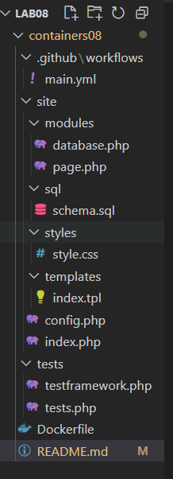
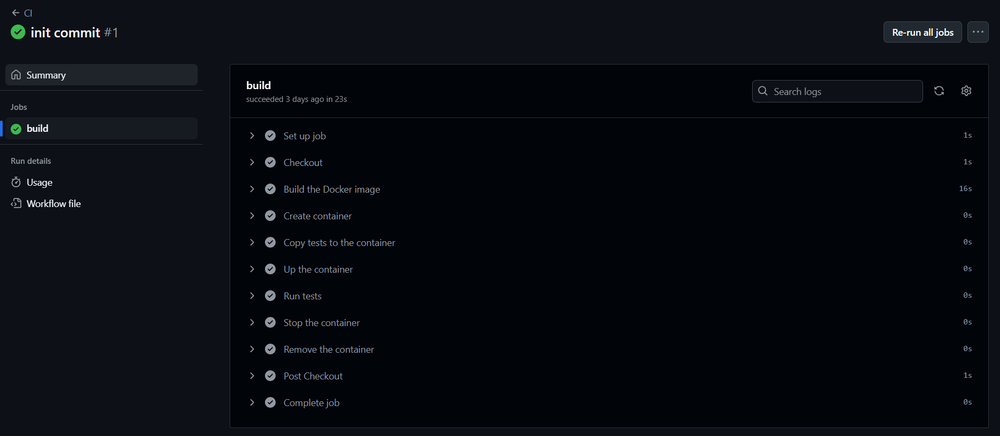

# Integrare continuă cu Github Actions
# Scopul lucrării
În cadrul acestei lucrări studenții vor învăța să configureze integrarea continuă cu ajutorul Github Actions.

# Sarcina
Crearea unei aplicații Web, scrierea testelor pentru aceasta și configurarea integrării continue cu ajutorul Github Actions pe baza containerelor.

# Realizarea lucrarii
1. am adaugat toate repozitoriile, fisierele si datele neccesare.

2. am intrat in git hub actions si am asteptat realizarea 

# Raspuns la intrebari 
1. ce este integrarea contiua?
Integrarea continuă (CI) este un proces automat de testare și verificare a codului de fiecare dată când se fac modificări în proiect, pentru a preveni erorile și a menține codul stabil.
2. Pentru ce sunt necesare testele unitare? Cât de des trebuie să fie executate?
Testele unitare verifică dacă fiecare componentă funcționează corect. Ele trebuie executate la fiecare modificare a codului, ideal automat, la fiecare commit sau pull request.
3. Care modificări trebuie făcute în fișierul .github/workflows/main.yml pentru a rula testele la fiecare solicitare de trage (Pull Request)?
on:
  push:
    branches:
      - main
  pull_request:
    branches:
      - main
4. Ce trebuie adăugat în fișierul .github/workflows/main.yml pentru a șterge imaginile create după testare?
      - name: Remove Docker image
        run: docker rmi containers08
